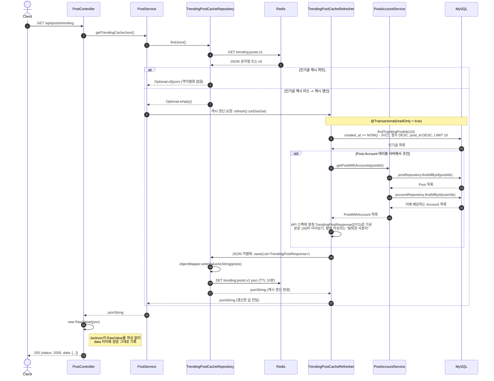
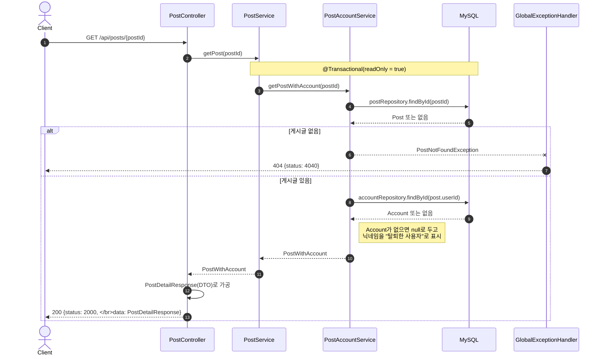
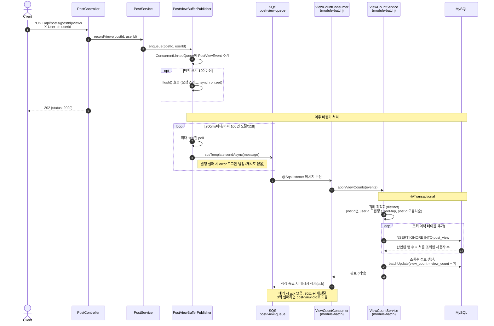
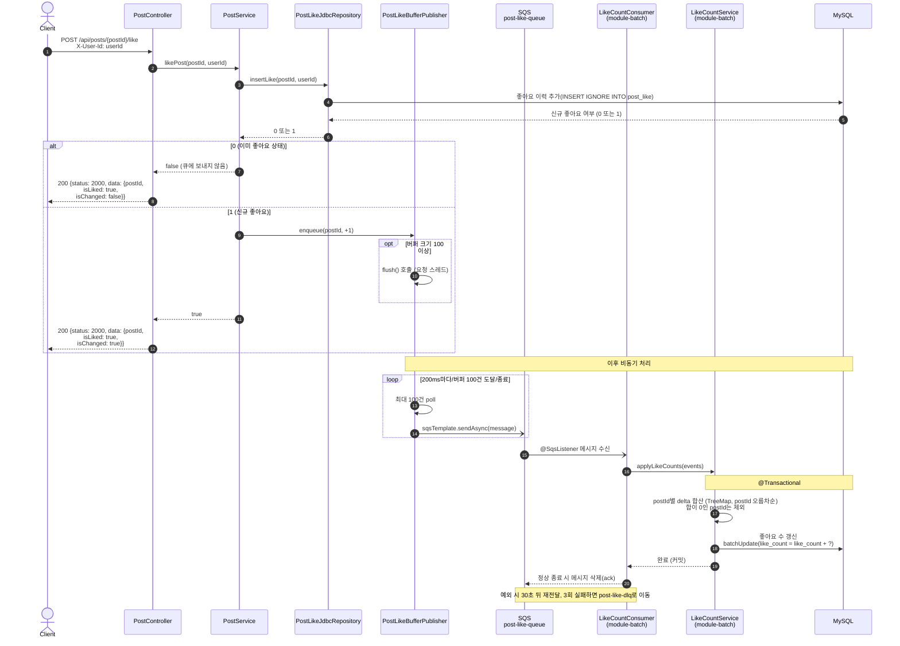
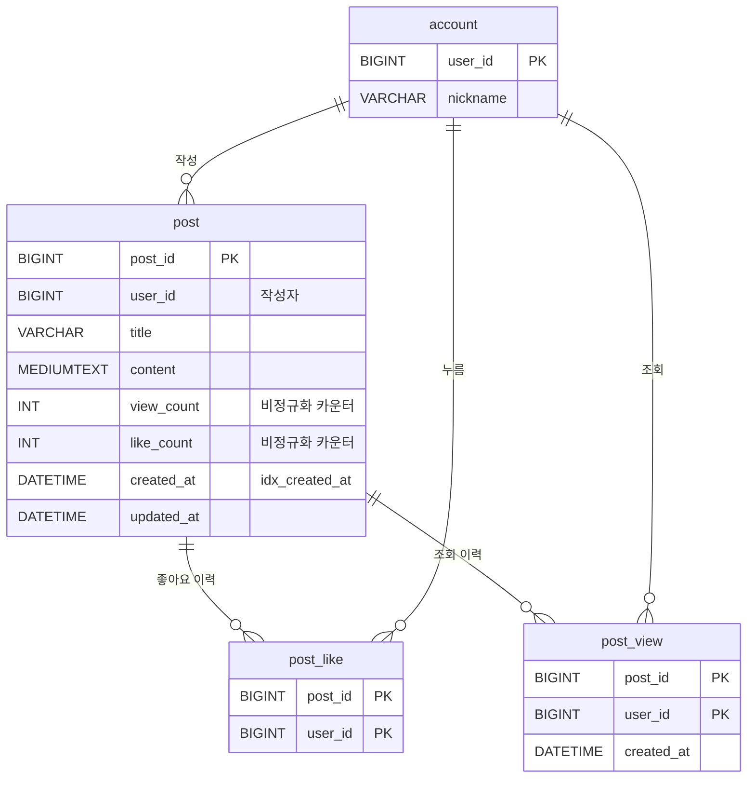

# 인기글 서비스

인기글 서비스는 아래 기준에 해당하는 상위 N개의 사용자 게시글을 보여줍니다.

인기글 선정 기준은 아래와 같습니다.

- **인기글 선정 기준**
    - `1.0 * 좋아요 수 + 0.05 * 조회 수 + 0.002 * 글자 수 - 1.0 * (현재 시각 - 작성 시각)`
    - 인기글은 **최근 3시간 내 작성된 게시글**에서 선정합니다.
    - 한 번 인기글이 되면 5분 정도는 유지되어도 무방합니다.

해당 커뮤니티에 게시글이 많아지고 많은 사용자들이 접속할 것을 가정하였습니다.

# 1. 기술스택

Docker, MySQL 8.0.2, Java 21, Spring Boot 4.1

# 2. 서비스 규모 가정

- 하루 평균 방문자 수 (DAU) : 350만 명
    
- 하루 평균 게시글 생성량 : 100만 개
    
- 인기글 산정 기준 중 `현재 시각 - 작성 시각` 이 있는데 단위를 ‘분’으로 가정함
    
    가장 오래된 게시글(3시간 전)의 시간감점의 경우
    
    if ‘**시간**’ : `현재 시각 - 작성 시각` = -3
    
    → 이는 3시간 동안 좋아요 3개/조회수 60개(0.05*60=3) 추가된다면 커버 가능하다는 의미.
    
    **시간 조건이 순위변동에 변별력을 주지 못함.**
    
    if ‘**분**’ : `현재 시각 - 작성 시각` = -180
    
    → 1분마다 1점씩 깎임. 1분마다 최소 좋아요 1개/조회수 20개(0.05*20=1)여야 커버 가능하다는 의미
    
    → **시간 조건이 순위변동에 변별력을 많이 줌.**

# 3. 모듈 구조
```
trending-service
├── module-core    # API ↔ Batch 간 메시지 계약 (이벤트 DTO)
├── module-api     # REST API, 인기글 캐시, 이벤트 버퍼 & SQS 발행
└── module-batch   # SQS 소비, 조회수·좋아요 수 RDB 반영
```
`module-api`와 `module-batch`는 서로를 의존하지 않고 `module-core`만 공유합니다. `module-core`에는 두 서버가 주고받는 메시지 형식만 들어 있어, 큐 메시지 스펙이 이곳에서 관리됩니다.

| 클래스 | 필드 |
| --- | --- |
| `PostViewEvent` | `postId`, `userId` |
| `PostLikeEvent` | `postId`, `delta` (+1 / -1) |
| `PostViewBatchMessage` / `PostLikeBatchMessage` | `batchId`, `serverInstanceId`, `createdAt`, `events` |


# 4. 주요 API 시퀀스 다이어그램

## 인기글 목록 조회 API
    

- **5분 주기 갱신**: 요구사항의 "한 번 인기글이 되면 5분 정도는 유지되어도 무방"을 근거로, 매 요청마다 계산하지 않고 5분마다 한 번만 계산합니다.
- **TTL 10분**: 스케줄러 주기(5분)보다 길게 잡아, 갱신 직전에 키가 만료되어 캐시가 비는 구간을 없앴습니다.
- **완성된 응답 캐싱**: 엔티티가 아니라 최종 응답 DTO를 직렬화한 JSON 문자열을 저장하게 했습니다. 조회 시에는 역직렬화 없이 Jackson `RawValue`로 감싸 그대로 내려보냈습니다.
- **버전이 붙은 캐시 키** (`trending:posts:v1`): 응답 스펙이 바뀌면 키 버전을 올려 이전 형식의 캐시와 섞이지 않게 했습니다.
- **애플리케이션으로 테이블 조인**: 점수 쿼리는 `post_id`만 반환하고, 게시글과 작성자는 각각 `findAllById`(IN 쿼리)로 가져와 서버에서 조인했습니다. 작성자가 탈퇴한 경우 닉네임을 "탈퇴한 사용자"로 표시했습니다.

## 게시글 상세 조회 API



## 게시글 조회수 업데이트 API


- **하나의 포스트 조회수는 사용자당 평생 1회**로 집계했습니다. `post_view`의 PK가 `(post_id, user_id)`이므로 `INSERT IGNORE`가 실제로 삽입한 행 수가 곧 새로 늘어날 조회수입니다.
- 따라서 같은 메시지를 다시 받아도 이미 `post_view`에 행이 있어 조회수가 중복으로 오르지 않습니다.
- **데드락 방지**: 한 메시지에 여러 게시글의 이벤트가 섞여 있고 컨슈머가 동시에 여러 개 돌 수 있으므로, `TreeMap`으로 `postId` 오름차순으로 정렬해 모든 컨슈머가 같은 순서로 행 잠금을 잡게 했습니다.

### API 서버: 이벤트 버퍼
> `PostViewBufferPublisher`와 `PostLikeBufferPublisher`는 같은 구조입니다.

- 요청이 들어오면 이벤트를 `ConcurrentLinkedQueue`에 넣고 바로 응답합니다.
- **100건이 쌓이거나 200ms가 지나면** (`@Scheduled(fixedDelay = 200)`) 최대 100건을 꺼내 하나의 배치 메시지로 묶어 `SqsTemplate.sendAsync`로 발행합니다. 발행은 비동기라 요청 스레드를 붙잡지 않습니다.
- 서버가 정상 종료될 때는 `@PreDestroy`에서 남은 이벤트를 마저 발행하게 했습니다.
- 메시지에는 `batchId`, 발행한 서버의 `serverInstanceId`, 생성 시각이 함께 담겨 추적에 사용되게 했습니다.

### 큐 설정 (`elasticmq.conf`)

| 설정 | 값 | 의미 |
| --- | --- | --- |
| `receiveMessageWait` | 20초 | Long polling으로 빈 응답 호출을 줄임 |
| `defaultVisibilityTimeout` | 30초 | 처리 중인 메시지를 다른 컨슈머가 가져가지 못하는 시간 |
| DLQ `maxReceiveCount` | 3 | 3회 처리에 실패하면 `*-dlq`로 이동 |

## 게시글 좋아요 API


- **이력은 동기, 카운트는 비동기**: 중복 좋아요를 막고 응답에 실제 변경 여부(`isChanged`)를 담기 위해 `post_like` 이력은 요청 시점에 바로 DB에 쓰게 했습니다. 부하가 큰 `post.like_count` UPDATE만 큐로 넘깁니다.
- **쿼리 최적화**: 한 배치 안에서 눌렀다 취소해 delta 합이 0이 된 게시글은 UPDATE를 생략했습니다.
- **데드락 방지**: 조회수와 마찬가지로 `postId` 오름차순으로 처리해 데드락을 방지했습니다.

### 커넥션 풀 분리

| 서버 | HikariCP 최대 / 최소 유휴 | 비고 |
| --- | --- | --- |
| module-api | 30 / 10 | OSIV 비활성화로 트랜잭션이 끝나면 커넥션을 바로 반환 |
| module-batch | 10 / 5 | 카운터 쓰기 부하가 API 서버 커넥션 풀에 영향을 주지 않음 |

# 5. 데이터 모델



- `post.view_count`, `post.like_count`는 인기글 점수를 `post` 테이블 하나로 계산하기 위해 반정규화한 것입니다. "누가 조회했는가 / 눌렀는가"의 기준(SSOT)은 `post_view`, `post_like` 이력 테이블입니다.
- 테이블 간 관계는 논리적 관계이며, FK 제약은 걸지 않았습니다.
