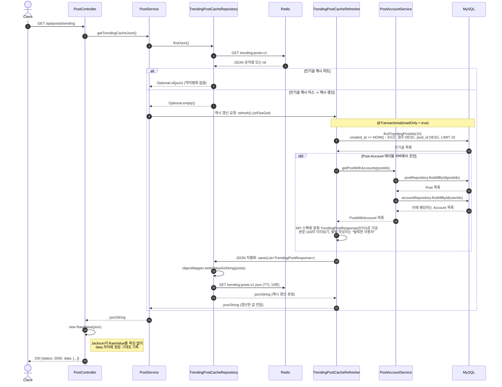
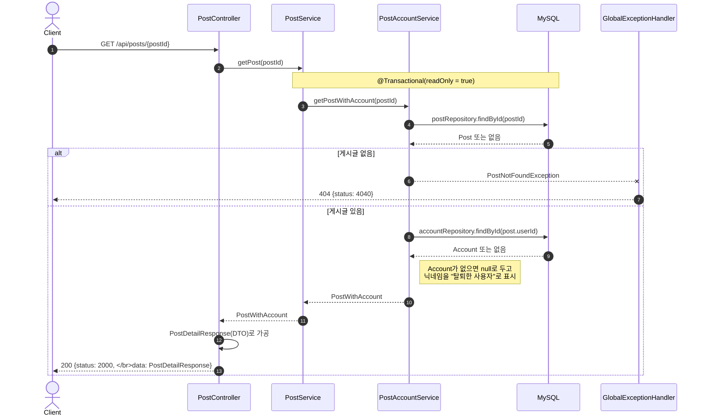
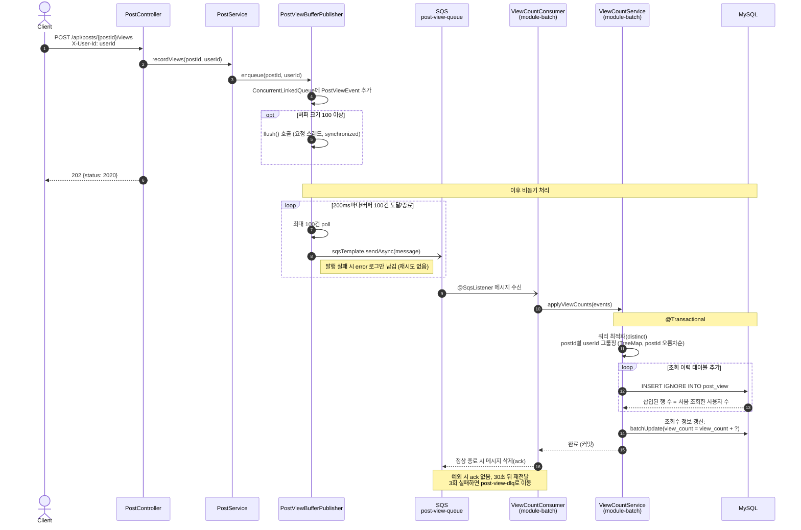
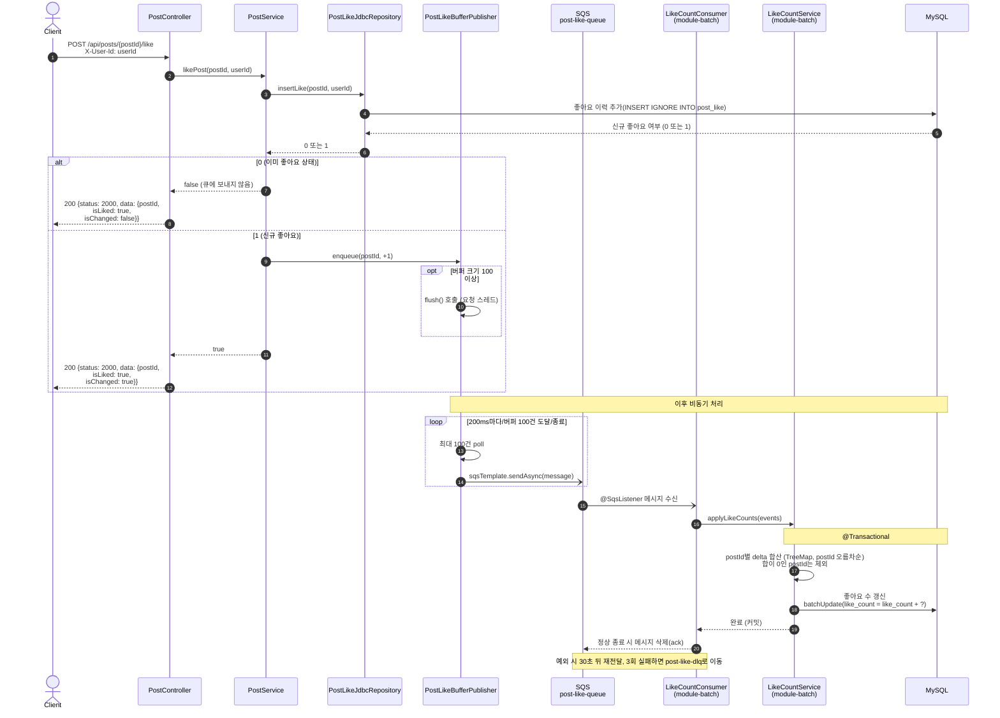

# 인기글 서비스

인기글 서비스는 아래 기준에 해당하는 상위 N개의 사용자 게시글을 보여줍니다.

인기글 선정 기준은 아래와 같습니다.

- **인기글 선정 기준**
    - `1.0 * 좋아요 수 + 0.05 * 조회 수 + 0.002 * 글자 수 - 1.0 * (현재 시각 - 작성 시각)`
    - 인기글은 **최근 3시간 내 작성된 게시글**에서 선정합니다.
    - 한 번 인기글이 되면 5분 정도는 유지되어도 무방합니다.

해당 커뮤니티에 게시글이 많아지고 많은 사용자들이 접속할 것을 가정하였습니다.

# 1. 기술스택

Docker, MySQL 8.0.2, Java 21, Spring Boot 4.1

# 2. 서비스 규모 가정

- 하루 평균 방문자 수 (DAU) : 350만 명
    
- 하루 평균 게시글 생성량 : 100만 개
    
- 인기글 산정 기준 중 `현재 시각 - 작성 시각` 이 있는데 단위를 ‘분’으로 가정함
    
    가장 오래된 게시글(3시간 전)의 시간감점의 경우
    
    if ‘**시간**’ : `현재 시각 - 작성 시각` = -3
    
    → 이는 3시간 동안 좋아요 3개/조회수 60개(0.05*60=3) 추가된다면 커버 가능하다는 의미.
    
    **시간 조건이 순위변동에 변별력을 주지 못함.**
    
    if ‘**분**’ : `현재 시각 - 작성 시각` = -180
    
    → 1분마다 1점씩 깎임. 1분마다 최소 좋아요 1개/조회수 20개(0.05*20=1)여야 커버 가능하다는 의미
    
    → **시간 조건이 순위변동에 변별력을 많이 줌.**

# 3. 주요 API 시퀀스 다이어그램

- 인기글 목록 조회 API
    

- 게시글 상세 조회 API

- 게시글 조회수 업데이트 API

- 게시글 좋아요 API

